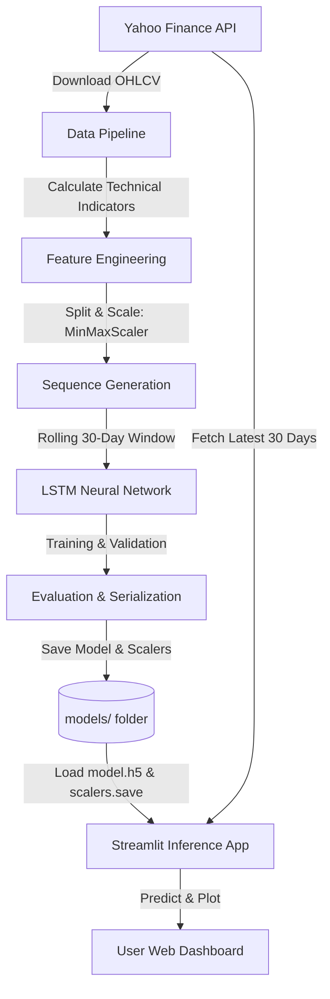

# 🧠 AI Stock Prediction System — Next Day Close Forecast (LSTM)

A deep learning-based stock market prediction system that utilizes **LSTM (Long Short-Term Memory)** neural networks to forecast the **next day’s closing price** for any stock ticker listed on Yahoo Finance.

This repository implements a modular data pipeline, technical indicator extraction, deep learning model training, and an interactive **Streamlit web dashboard** to visualize predictions.

---

## 📊 Pipeline Architecture

The system operates in two main phases: **Training / Serialization** and **Interactive Web Dashboard / Inference**. 



---

## 🧰 Tech Stack & Libraries

| Component | Technology / Library | Purpose |
| :--- | :--- | :--- |
| **Language** | Python 3.11+ | Core runtime |
| **ML Framework** | TensorFlow / Keras (2.20.0+) | LSTM neural network modeling |
| **Data Processing** | Pandas, NumPy | Data cleaning, manipulation, and array operations |
| **Preprocessing** | Scikit-learn (1.5.2+) | Feature scaling (`MinMaxScaler`) and metrics evaluation |
| **Technical Analysis** | `ta` (0.11.0+) | Automatic computation of RSI, MACD, and EMA |
| **Data Source** | `yfinance` (0.2.40+) | Downloading historical stock price and volume data |
| **Visualization** | Matplotlib, Seaborn | Generating static comparison charts |
| **Dashboard** | Streamlit (1.39.0+) | Interactive, responsive web UI |

---

## 🛠️ Feature Engineering & Data Preprocessing

To train the LSTM network on rich financial patterns, the data pipeline extracts **15 distinct features** from raw price history:

### 1. Market Price & Volume
*   **Adj Close**: The target variable representing the adjusted closing price.
*   **Open, High, Low, Volume**: Raw daily trading range and activity level.

### 2. Trend Indicators (Moving Averages)
*   **SMA_5 & SMA_10**: 5-day and 10-day Simple Moving Averages to capture short-term price directions.
*   **EMA_12**: 12-day Exponential Moving Average, placing more weight on recent prices.

### 3. Momentum Oscillators
*   **RSI_14**: 14-day Relative Strength Index to identify overbought (>70) or oversold (<30) conditions.
*   **MACD & MACD_Signal**: Moving Average Convergence Divergence and its signal line to detect trend reversals and momentum shifts.

### 4. Volatility & Temporal Features
*   **Return_1d**: 1-day percentage return of the stock.
*   **lag_1, lag_2, lag_3**: The closing price of the 1, 2, and 3 previous trading days, helping the model capture short-term memory transitions directly.

### 5. Scaling & Sequence Creation
*   **Feature Scaling**: Both features ($X$) and targets ($y$) are scaled independently using a `MinMaxScaler` bound between `[0, 1]` to optimize LSTM convergence.
*   **Sequence Generation**: Creates overlapping inputs using a **rolling window of 30 trading days** (meaning the model reviews the past 30 days of data to predict the close price of day 31).

---

## 🧠 LSTM Deep Learning Model Architecture

The neural network is built with a sequential architecture designed to learn short-term temporal dependencies while avoiding gradient vanishing:

1.  **LSTM Layer 1**: 64 units, returns full sequence (`return_sequences=True`) to feed into the next LSTM layer.
2.  **Dropout Layer 1**: 20% dropout rate to reduce overfitting by randomly disabling nodes during training.
3.  **LSTM Layer 2**: 32 units, does not return sequences (`return_sequences=False`), collapsing the output to a dense vector.
4.  **Dropout Layer 2**: 20% dropout rate.
5.  **Dense Output Layer**: 1 node with a linear activation function to predict the single scaled closing price.

### ⚙️ Training Parameters & Callbacks
*   **Optimizer**: Adam (Adaptive Moment Estimation)
*   **Loss Function**: Mean Squared Error (MSE)
*   **Metrics Tracked**: Mean Absolute Error (MAE)
*   **Batch Size**: 32
*   **Epochs**: Up to 80
*   **Callbacks**:
    *   `EarlyStopping`: Monitors validation loss and stops training if it doesn't improve for **10 consecutive epochs**, restoring the best weight configuration.
    *   `ReduceLROnPlateau`: Halves the learning rate (factor of 0.5) if validation loss plateaus for **5 epochs**, enabling fine-grained weight adjustments near local minima.

---

## ⚙️ Installation & Setup

### 1️⃣ Clone the Repository
```bash
git clone https://github.com/hampannagouda/ai-stock-prediction.git
cd ai-stock-prediction
```

### 2️⃣ Create a Virtual Environment
Create a virtual environment to manage dependencies cleanly:
```bash
python -m venv venv
```

To activate it:
*   **Windows (Command Prompt / PowerShell)**:
    ```powershell
    .\venv\Scripts\activate
    ```
*   **macOS / Linux (Bash / Zsh)**:
    ```bash
    source venv/bin/activate
    ```

### 3️⃣ Install Dependencies
> [!NOTE]
> On Windows machines running strict **Application Control (WDAC) or AppLocker policies**, invoking `pip.exe` directly inside the virtual environment may be blocked. To bypass this, run pip as a python module instead:
> ```powershell
> .\venv\Scripts\python.exe -m pip install -r requirements.txt
> ```

---

## 🚀 Running the Application

### 🏋️ Step 1: Train the Model (Optional)
The project comes with a pre-trained model for Apple (`AAPL`). If you wish to retrain the model or train it on a different default stock, run:
```bash
python train_lstm.py
```
This script will:
1.  Download historical data for `AAPL` starting from January 1, 2015.
2.  Preprocess the data and extract technical indicators.
3.  Execute model training (printing validation metrics per epoch).
4.  Evaluate accuracy using **MAE** and **RMSE** on the test dataset.
5.  Save the model (`models/lstm_model.h5`) and the custom scalers (`scaler_x.save`, `scaler_y.save`).

### 🖥️ Step 2: Launch the Web Dashboard
Start the Streamlit server:
```bash
streamlit run app.py
```
> [!TIP]
> If `streamlit.exe` is blocked by an execution policy on Windows, launch it using Python:
> ```powershell
> .\venv\Scripts\python.exe -m streamlit run app.py
> ```

Open your browser at `http://localhost:8501`. 

---

## 🧩 Project Structure

```
ai-stock-prediction/
│
├── data_pipeline.py        # Data downloading, feature engineering, and sequence generation
├── train_lstm.py           # Model definition, compilation, training, and evaluation
├── app.py                  # Streamlit web application frontend and prediction logic
├── requirements.txt        # Package dependencies
├── runtime.txt             # Required Python version
├── README.md               # Extensive project documentation
│
└── models/                 # Serialized assets
    ├── lstm_model.h5       # Trained Keras LSTM neural network
    ├── scaler_x.save       # MinMaxScaler object fit on features (X)
    ├── scaler_y.save       # MinMaxScaler object fit on target (y)
    └── stock.ipynb         # Experimental notebook containing visual analyses
```

---

## 🔮 Future Enhancements
*   **Sentiment Integration**: Process financial headlines and tweets using Sentiment NLP (e.g., FinBERT) to guide predictions.
*   **Transformer Models**: Experiment with temporal attention mechanism networks (e.g., Temporal Fusion Transformers).
*   **Live Stream Integration**: Implement WebSockets with AlphaVantage or Alpaca to stream live intraday ticks.
*   **Cloud Deployment**: Deploy the interactive dashboard directly on Streamlit Community Cloud or Heroku.
